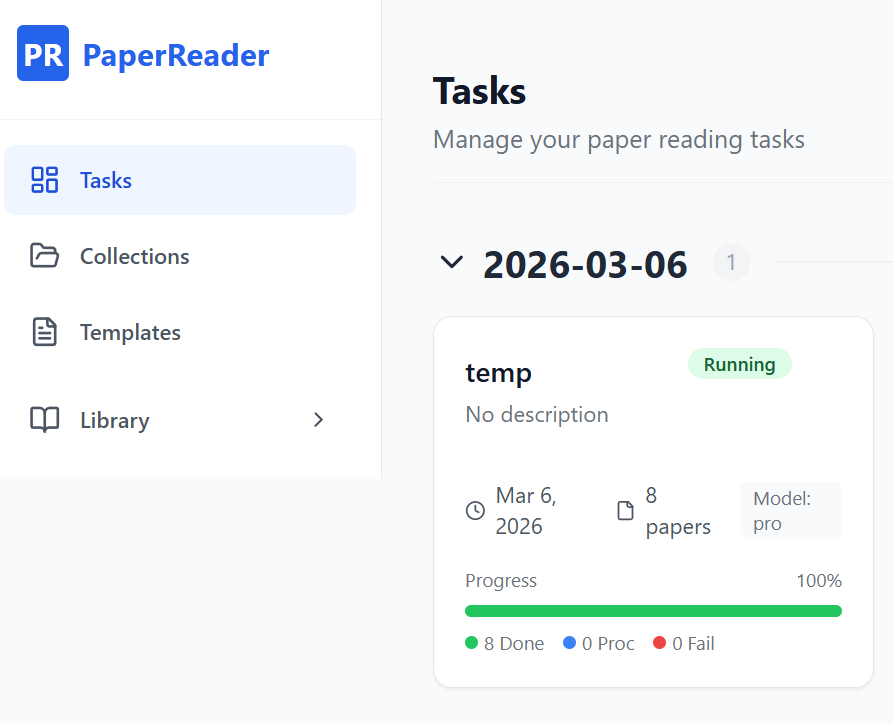
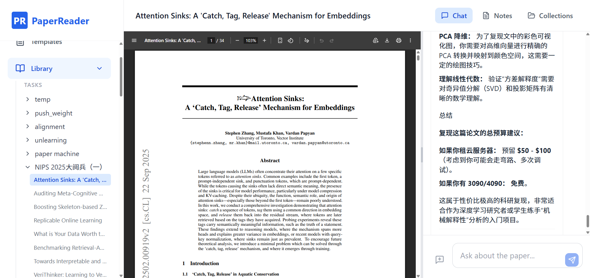

# Paper Reader / 论文阅读助手

Paper Reader is a local AI-powered academic paper reading assistant. It helps you manage reading lists, automatically download papers from Arxiv/OpenReview, and uses Gemini 3 to interpret and summarize papers.
Paper Reader 是一个本地 AI 驱动的学术论文阅读助手。它帮助你管理阅读清单，自动从 Arxiv/OpenReview 下载论文，并使用 Gemini 3 来解读和总结论文。




### Video Showcase / 视频展示
[Watch the demo video / 观看演示视频](https://www.bilibili.com/video/BV1gNNuzzEWJ/?spm_id_from=333.1387.homepage.video_card.click&vd_source=910a83c9601312e34c7ebcf4051f6ad2)

## Features / 功能特性

- **Task Management**: Create reading tasks and organize papers.
  **任务管理**：创建阅读任务并组织论文。
- **Auto Download**: Automatically search and download PDFs from Arxiv and OpenReview.
  **自动下载**：自动从 Arxiv 和 OpenReview 搜索并下载 PDF。
- **AI Interpretation**: Use Google Gemini models to summarize and chat with papers.
  **AI 解读**：使用 Google Gemini 模型总结论文并进行对话。
- **Local Storage**: All PDFs and data are stored locally on your machine.
  **本地存储**：所有 PDF 和数据都存储在你的本地机器上。
- **Reading Room**: Dedicated interface for reading and chatting with papers.
  **阅读室**：专用于阅读和与论文对话的界面。

## Installation & Setup / 安装与配置

[Watch the installation tutorial / 观看安装教程](https://www.bilibili.com/video/BV1gNNuzzEpZ/?spm_id_from=333.1387.homepage.video_card.click)

### 1. Clone the Repository / 克隆仓库

```bash
git clone https://github.com/ZHIXINXIE/papereader.git
cd papereader
```

### 2. Configure Environment Variables / 配置环境变量

You need a Google Gemini API Key to use the AI features.
你需要一个 Google Gemini API Key 来使用 AI 功能。

1.  Get your API Key from [Google AI Studio](https://aistudio.google.com/).
    从 [Google AI Studio](https://aistudio.google.com/) 获取你的 API Key。
2.  Set the `GEMINI_API_KEY` environment variable:
    设置 `GEMINI_API_KEY` 环境变量：

    **Windows (PowerShell):**
    ```powershell
    $env:GEMINI_API_KEY="your_api_key_here"
    ```

    **Mac/Linux:**
    ```bash
    export GEMINI_API_KEY="your_api_key_here"
    ```

    *(Replace `your_api_key_here` with your actual API key)*
    *（将 `your_api_key_here` 替换为你实际的 API key）*

    **Verify configuration / 验证配置:**

    You can run these commands to check if the key is set correctly:
    你可以运行以下命令来检查 Key 是否配置正确：

    ```bash
    # Windows (PowerShell)
    echo $env:GEMINI_API_KEY

    # Mac/Linux
    echo $GEMINI_API_KEY
    ```

### 3. Install Dependencies / 安装依赖

**Backend (Python) / 后端 (Python):**

It is recommended to use a virtual environment.
推荐使用虚拟环境。

```bash
# Create virtual environment with Conda / 使用 Conda 创建虚拟环境
conda create -n paperreader python=3.10

# Activate virtual environment / 激活虚拟环境
conda activate paperreader

# Install requirements / 安装依赖包
pip install -r backend/requirements.txt

# Install node.js by conda / 使用 Conda 安装 node.js
conda install -n paperreader -c conda-forge nodejs
```
Note: after installing node.js, you need to add the node address to the environment variables, otherwise the startup script will report an error.
注意,在安装 node.js 后,你需要将 node 的地址添加到环境变量中,否则启动脚本会报错。

Directly run `node -v` in the terminal to check if node.js is installed successfully.
在终端直接运行 `node -v` 来检查 node 是否安装成功。 

**Frontend (Node components) / 前端 (Node.js 组件):**

```bash
cd frontend
npm install
```
### 4. (Optional) Add Alias / 添加别名
Running `python start.py` in the corresponding folder every time might be a bit cumbersome. Therefore, consider packaging these steps into a single command that can be executed directly from the command line. Alternatively, you could package it into a batch file.
如果每一次都要到对应的文件夹去执行python start.py，可能有一点麻烦。所以可以考虑将这些步骤打包成一个在命令行可以直接执行的命令。或者也可以将它直接打包为一个批处理文件.

In Windows, you can do as the follow:
在 Windows 系统中，您可以按以下步骤操作：
1. open powershell
打开 PowerShell
2. run notepad $PROFILE
运行 notepad $PROFILE
3. add the following lines to the files:
将以下几行添加到文件中：
```bash
  function paperreader {
      cd ../../paperreader(your paperreader project folder)
      conda activate paperreader
      python .\start.py
  }
```
4. open a new powershell window and run `paperreader` to start the application.
打开一个新的 PowerShell 窗口，运行 `paperreader` 来启动应用程序。

在 Linux 或 macOS 系统中，您可以按以下步骤操作：
1. Open a terminal.
打开终端
2. Run `nano ~/.bashrc` or `nano ~/.zshrc` (depending on your shell).
运行 `nano ~/.bashrc` 或 `nano ~/.zshrc` （根据您的 shell 类型）
3. Add the following lines to your file:
将以下几行添加到文件中：

```bash
  function paperreader {
      cd ../../paperreader(your paperreader project folder)
      conda activate paperreader
      python .\start.py
  }
```
4. Save the file and exit the editor.
保存文件并退出编辑器

5. Run `source ~/.bashrc` or `source ~/.zshrc` (depending on your shell) to activate the alias.
运行 `source ~/.bashrc` 或 `source ~/.zshrc` （根据您的 shell 类型）来使别名生效。


## Running the Application / 运行应用

We provide a convenient startup script that launches both the backend and frontend services.
我们提供了一个便捷的启动脚本，可以同时启动后端和前端服务。

**Make sure you are in the root `papereader` directory.**
**请确保你位于根目录 `papereader` 下。**

```bash
# Ensure your virtual environment is activated if you used one
# 如果你使用了虚拟环境，请确保已激活
cd ..
python start.py
```

- **Frontend / 前端**: http://localhost:5173 (Open this in your browser / 在浏览器中打开)
- **Backend API / 后端 API**: http://localhost:8000/docs

## Troubleshooting / 故障排除

-   **"GEMINI_API_KEY not found"**: Please configure your `GEMINI_API_KEY` in the environment variables.
    **"GEMINI_API_KEY not found"**：请在环境变量中配置你的 `GEMINI_API_KEY`。
-   **Node modules missing**: If `start.py` fails to install frontend dependencies, try running `npm install` manually inside the `frontend` folder.
    **Node modules missing**：如果 `start.py` 安装前端依赖失败，请尝试在 `frontend` 文件夹内手动运行 `npm install`。
-   **Port already in use**: Ensure ports 8000 (Backend) and 5173 (Frontend) are free.
    **Port already in use**：确保端口 8000 (后端) 和 5173 (前端) 未被占用。

## Project Structure / 项目结构

-   `backend/`: Python FastAPI application, database, and services.
    `backend/`：Python FastAPI 应用程序、数据库和服务。
-   `frontend/`: React + TypeScript + Vite application.
    `frontend/`：React + TypeScript + Vite 应用程序。
-   `data/`: Created automatically. Stores your database (`app.db`) and downloaded PDFs.
    `data/`：自动创建。存储你的数据库 (`app.db`) 和下载的 PDF 文件。
-   `start.py`: Launcher script.
    `start.py`：启动脚本。
